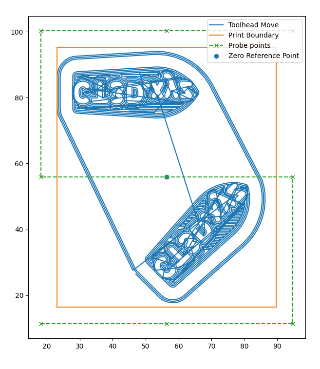

Klipper Adaptive Bed Mesh
===
[中文版](readme_zh_cn.md)

# What is it?
The *Adaptive Bed Mesh* plugin is designed to generate the bed mesh parameter based on the sliced part dynamically. 
With finer bed mesh density around printed parts you can achieve better accuracy and lesser time spent on probing.

The *Adaptive Bed Mesh* plugin is inspired from multiple open source project
- [Klipper mesh on print area only install guide](https://gist.github.com/ChipCE/95fdbd3c2f3a064397f9610f915f7d02)
- [Klipper Adaptive meshing & Purging](https://github.com/kyleisah/Klipper-Adaptive-Meshing-Purging)

## Features
The *Adaptive Bed Mesh* plugin supports 3 operating modes. By default, the below list is also the precedence of the operation. 
1. First layer min/max provided by the slicer.
2. Object shapes detection by Klipper Exclude Object.
3. Object shapes detection by GCode analysis.

If all above modes are failed then the *Adaptive Bed Mesh* will fall back to the default full bed mesh configuration. 

### First layer min/max provided by the slicer
Most slicer can export the min (closest to 0,0) and max coordinate of the first layer extrude motions. 
Below are syntax for few famous slicers. 
#### Orca Slicer / Super Slicer / Prusa Slicer

    ADAPTIVE_BED_MESH_CALIBRATE AREA_START={first_layer_print_min[0]},{first_layer_print_min[1]} AREA_END={first_layer_print_max[0]},{first_layer_print_max[1]}

#### Cura

    ADAPTIVE_BED_MESH_CALIBRATE AREA_START=%MINX%,%MINY% AREA_END=%MAXX%,%MAXY%

Copied from [Klipper mesh on print area only install guide](https://gist.github.com/ChipCE/95fdbd3c2f3a064397f9610f915f7d02)
> *(Cura slicer plugin) To make the macro to work in Cura slicer, you need to install the [post process plugin by frankbags](https://raw.githubusercontent.com/ChipCE/Slicer-profile/master/cura-slicer/scripts/KlipperPrintArea.py)
> - In cura menu Help -> Show configuration folder. 
> - Copy the python script from the above link in to scripts folder. 
> - Restart Cura 
> - In cura menu Extensions -> Post processing -> Modify G-Code and select Klipper print area mesh

### Object shapes detection by Klipper Exclude Object.
The [Klipper Exclude Object](https://www.klipper3d.org/Exclude_Object.html) collects the printed part boundary for 
object exclude functionality. Subject to the Slicer, the printed part boundary can be a simple boundary box, or complicated
hull of the object geometry. 

There is no special parameter to activate the object shape detection based bed mesh. If the Exclude Object feature is [enabled from Klipper](https://www.klipper3d.org/Config_Reference.html#exclude_object)
and your slicer supports such feature, then the bed mesh area will be calculated based on all registered boundaries.

### Object shapes detection by GCode analysis
As the last line of defense, when all above detection algorithms are failing (or disabled), the object boundaries shall be 
determined by the GCode analysis.

The GCode analysis will evaluate all extrude moves (G0, G1, G2, G3) and create the object boundary by layers. It
will evaluate all layers unless the [mesh fade](https://www.klipper3d.org/Bed_Mesh.html#mesh-fade) is configured.

For example, with the below `[bed_mesh]` section, the GCode analysis will stop at 10mm from the bed while the klipper stops the 
bed mesh compensation at the same height. 

    [bed_mesh]
    ...
    fade_start: 1
    fade_end: 10
    fade_target: 0

# Configurations
## [bed_mesh]
The *Adaptive Bed Mesh* will use values from `[bed_mesh]` sections. Below are required attributes. Please make sure the min/max
coordinates are within the safe probing boundaries. 

    [bed_mesh]
    # The mesh start coordinate. The adaptive bed mesh will not generate points smaller than this coordinate.
    mesh_min: 20, 20

    # The maximum coordinate of the bed mesh. The adapter bed mesh will not generate points greater than this coordinate.
    # Note: This is not necessarily the last point of the probing sequence.  
    mesh_max: 230,230

    # (Optional) The Z height in which fade should complete
    fade_end: 10

    # (Optional) The bed mesh interpolation algorithm. 
    # Reference: https://www.klipper3d.org/Bed_Mesh.html#mesh-interpolation
    algorithm: bicubic

> **_NOTE:_**  The `relative_reference_index` is now [deprecated](https://www.klipper3d.org/Bed_Mesh.html#the-deprecated-relative_reference_index). 

> **_NOTE:_** The `zero_reference_position` will be overwritten by the plugin so you don't need to configure it from the `[bed_mesh]`
> section. 

## [virtual_sdcard]
The *Adaptive Bed Mesh* will use values from `[virtual_sdcard]` sections. Below are required attributes. Usually `[virtual_sdcard]` is 
defined under the Mainsail or Fluidd configuration. 
    
    [virtual_sdcard]
    path: ~/printer_data/gcodes

## [adaptive_bed_mesh]
The `[adaptive_bed_mesh]` need to be declared under `printer.cfg`, after the `[exclude_object]`,  `[virtual_sdcard]` and `[bed_mesh]`. 

    [adaptive_bed_mesh]
    arc_segments: 80                     # (Optional) The number of segments for G2/3 to be decoded into linar motion. 
    mesh_area_clearance: 5               # (Optional) Expand the mesh area outside of the printed area in mm. 
    max_probe_horizontal_distance: 50    # (Optional) Maximum distance between two horizontal probe points in mm. 
    max_probe_vertical_distance: 50      # (Optional) Maximum distance between two vertical probe points in mm.
    use_relative_reference_index: False  # (Optional) For older Klipper (< 0.11.2xx), the `use_relative_reference_index` is used to determine the center point. This is not required for the newer release.

    # (Optional) Enable/Disable detection algorithm on demand
    disable_slicer_min_max_boundary_detection: False
    disable_exclude_object_boundary_detection: False
    disable_gcode_analysis_boundary_detection: False

## How to determine the maximum horizontal/vertical probe distances
The *Adaptive Bed Mesh* uses probe distance instead number of points to be probed to achieve better probe density consistency
with respect to parts in different sizes. 

To calculate the optimal probe distance, you can use the reference number of points for a full printed bed as an example. 
For a 250mm by 250mm square heater bed, a 5x5 mesh is generally sufficient. The maximum horizontal and vertical probe distance
can calculate by

    probe_distance = 250 / 5 = 50mm

# Usage
Call `ADAPTIVE_BED_MESH_CALIBREATE` as the part of `PRINT_START` macro is all you need. 

Example: 

    [gcode_macro PRINT_START]
    gcode:
        ...
        ADAPTIVE_BED_MESH_CALIBRATE
        ...

> **_NOTE:_**  If you're using the [Automatic Z-Calibration plugin](https://github.com/protoloft/klipper_z_calibration)
> then you need to ensure the `ADAPTIVE_BED_MESH_CALIBRATE` is called prior to `CALIBRATE_Z`.

# Install via Moonraker
Clone the repository to the home directory

    cd ~
    git clone https://github.com/eamars/klipper_adaptive_bed_mesh.git

You need to manually install the plugin for the first time. It will prompt for password to restart the Klipper process. 
    
    source klipper_adaptive_bed_mesh/install.sh

Then copy the below block into the moonraker.conf to allow automatic update.

    [update_manager client klipper_adaptive_bed_mesh]
    type: git_repo
    primary_branch: main
    path: ~/klipper_adaptive_bed_mesh
    origin: https://github.com/eamars/klipper_adaptive_bed_mesh.git
    install_script: install.sh

# Contribution
Contributions are welcome. However before making new pull requests please make sure the feature passes
the unit test in `test_adaptive_bed_mesh.py` and add new if necessary. 
